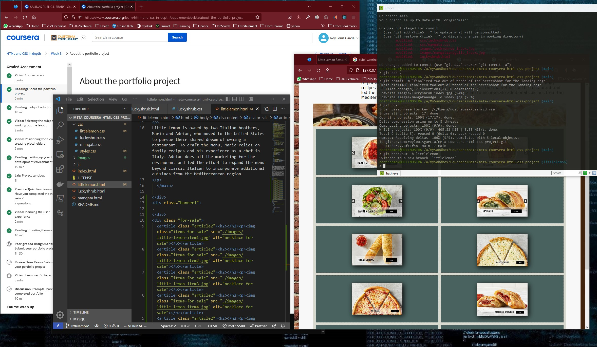
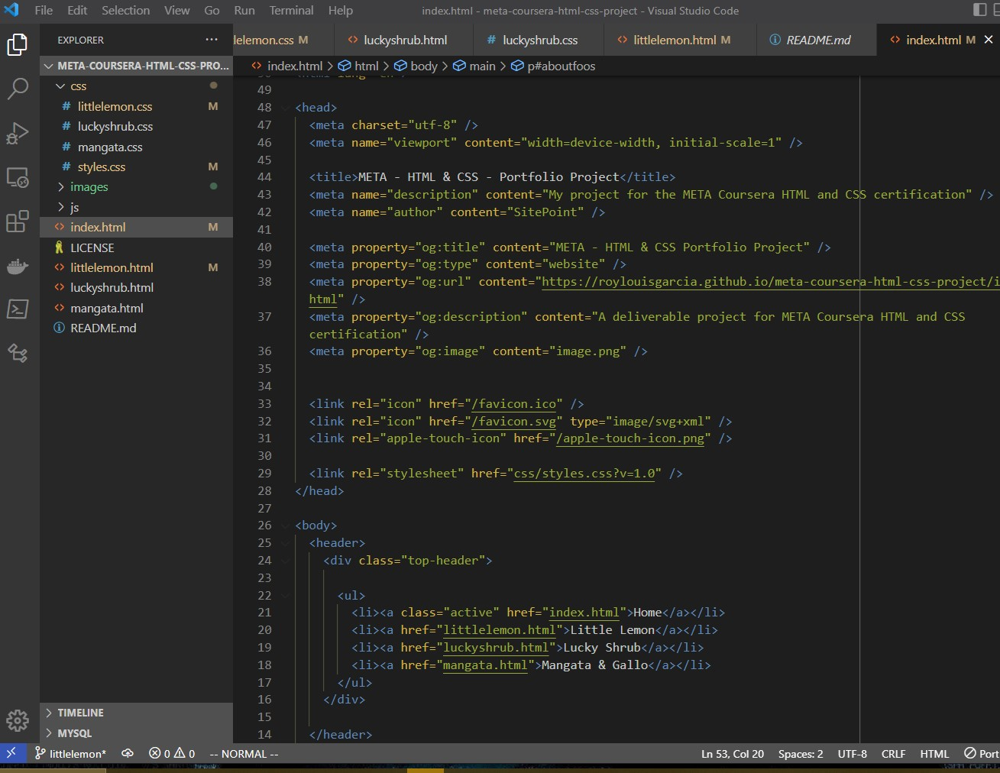
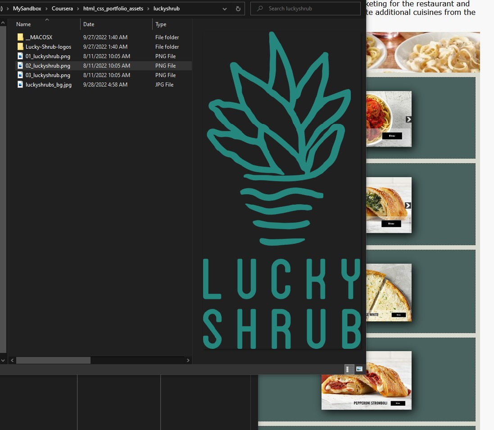
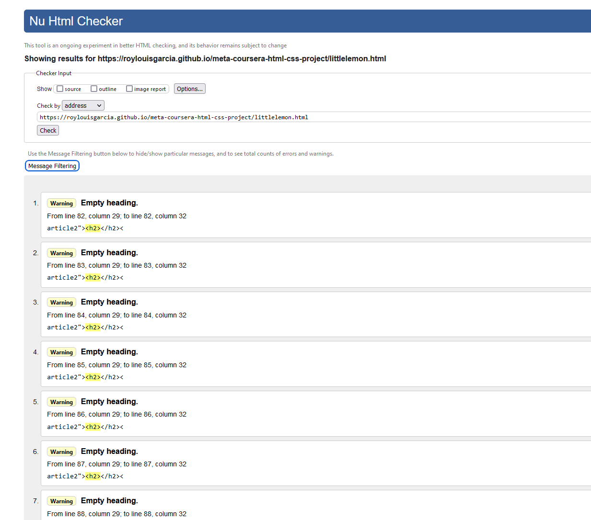
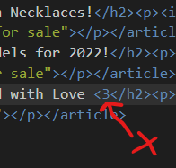
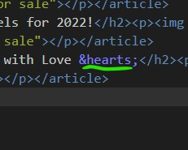
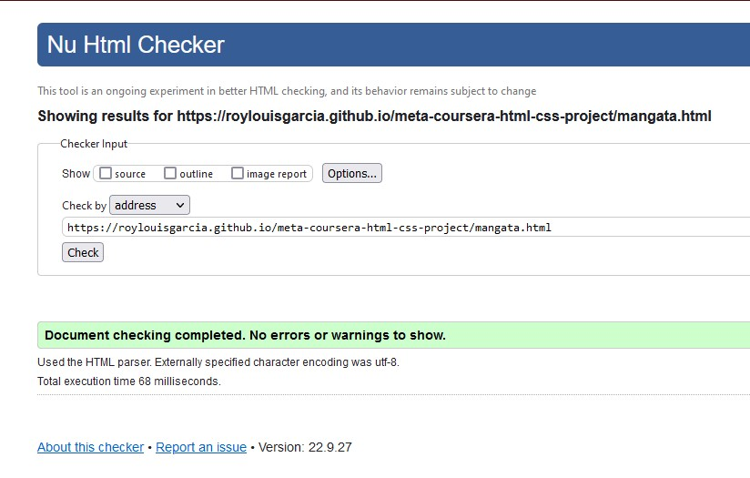
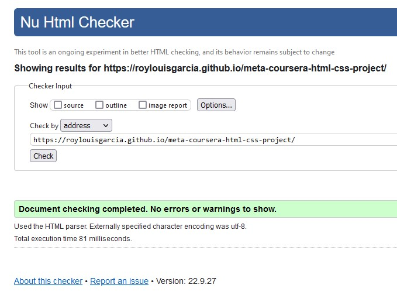
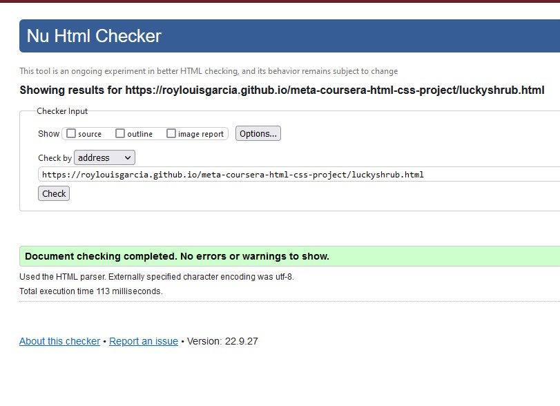
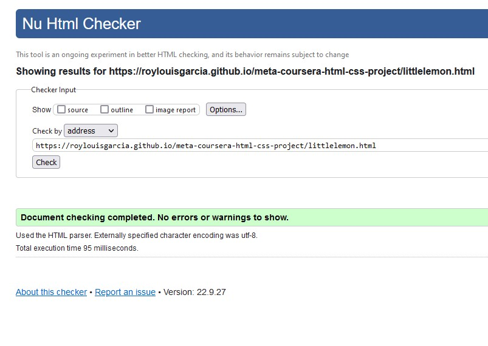

# The Course: Coursera/Meta HTML and CSS in Depth

### This course is 4 of 9 in the Meta Front-End Developer Specialization that is offered by Meta through Coursera.

- ##### In this course we learned about metadata and tags and how to use them to influence a web page's ranking through Search Engine Optimization (SEO).

- ##### We also learned about user input and forms and created and tested secured forms.

- ##### Use common semantic and meta tags to improve the accessibility, readability and SEO of a web page.

- ##### Create commonly-used web page layouts and components. 

- ##### Create and test a form with client-side validation. 

- ##### Recognize server-side connections and the languages used to carry out requests and     responses. 

- ##### Post form data to a server. 

- ##### Create a video and audio player that can rate the media played. 

- ##### Use Flexbox and CSS grids to create responsive layouts and charts. 

- ##### Use advanced CSS selectors such as pseudo-classes for targeted styling. 

- ##### Use CSS effects to introduce text effects, animations and transformations into your stylesheet. 

- ##### Create simple keyframe animations. 

- ##### Perform basic front-end testing, debugging and error handling. 

- ##### Adapt your CSS to perform as expected in different browsers.

### Screenshots of the process of doing the project:

# Challenges:

Checking for errors and warnings using NU validator is a must and a habit that I want to build early on. Doing so will help me tuned to the ideals of CI/CD of DevOps and I also find the links accompanying the warnings and errors very helpful. An example is learning from this page:  after getting this:

I also learned how to use ascii codes of certain emoticons that uses the "less than or greater than signal" that can affect the parsing of my code:

Which I replaced with:

# Resolved:

Finally got them validated: <3 ... ooops &hearts;  rather.. :)  oh no.. I don't know  what the ascii for this ":)" smiley face. Oh, well!

